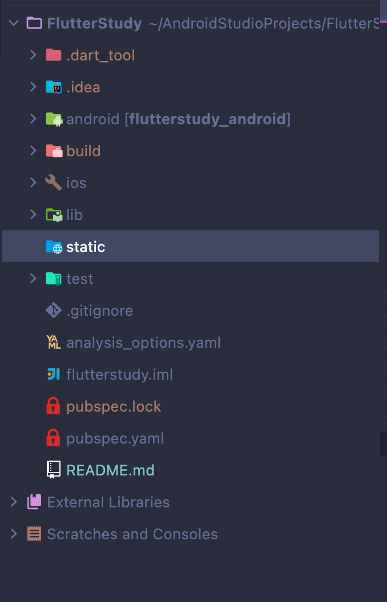
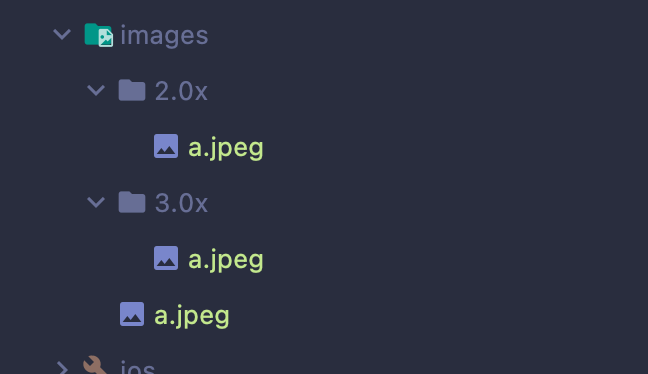
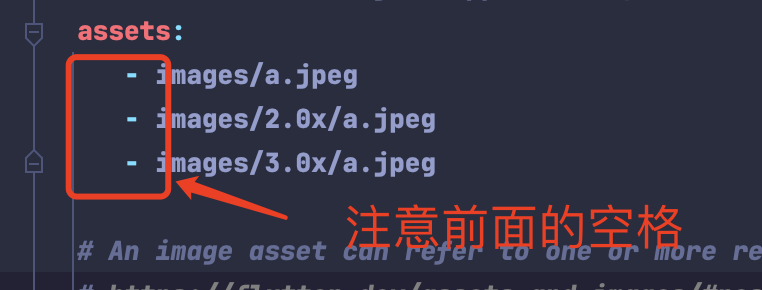
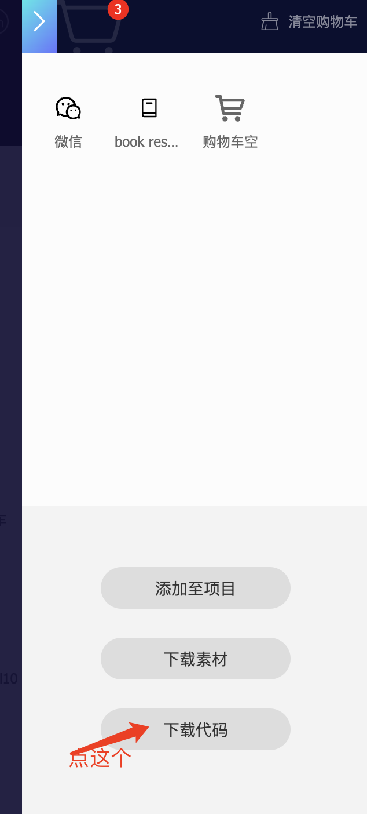
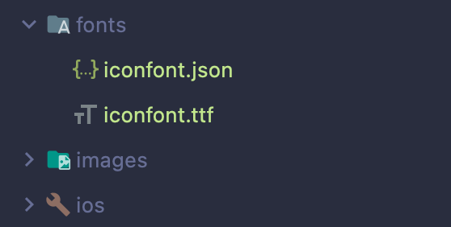
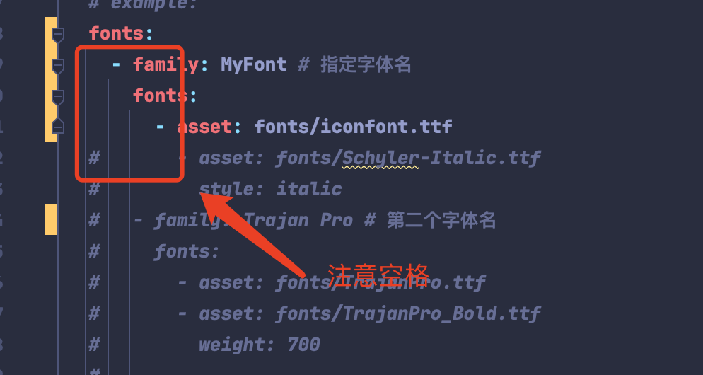

# FlutterStudy

本笔记是学习B站上的[视频课程](https://www.bilibili.com/video/BV1S4411E7LY?p=2&vd_source=7f3fdd89d8f49319865d708ed0bc9d3c)

视频课程中有一部分dart学习，这一部分我没有做笔记。

本项目使用的dart版本为：2.19.5，flutter版本为： 3.7.8

## Flutter介绍

Flutter是谷歌公司开发的一款开源、免费的UI框架，可以快速的在Android和iOS上构建高质量App。

它最大的特点就是跨平台、以及高性能。 目前 Flutter 已经支持 iOS、Android、Web、Windows、macOS、Linux等。

Flutter 官网：https://flutter.dev/

Flutter Packages官网：https://pub.dev/

## Flutter目录结构介绍

我在创建项目时并没有选择windows、macos、linux和web平台，所以没有生成这些平台的目录结构，static是我自己创建的用于存放截图的。

| 文件夹                | 作用                                                         |
| --------------------- | ------------------------------------------------------------ |
| android               | android平台相关代码                                          |
| ios                   | ios平台相关代码                                              |
| lib                   | flutter相关代码，我们编写的代码就在这个文件夹                     |
| test                  | 用于存放测试代码                                             |
| pubspec.yaml          | 配置文件，一般存放一些第三方库的依赖。                          |
| analysis_options.yaml | 分析dart语法的文件，老项目升级成新项目有警告信息的话可以删掉    |

其中lib目录下的main.dart是主入口文件，lib/pages下面存放的是二级界面

## MaterialApp 和 Scaffold两个组件

### MaterialApp

MaterialApp是一个方便的Widget，它封装了应用程序实现Material Design所需要的一些Widget。

一般作为顶层widget使用。

__常用属性：__

- home（主页）
- title（标题）
- color（颜色）
- theme（主题）
- routes（路由）

### Scaffold两个组件

Scaffold是Material Design布局结构的基本实现。

此类提供了用于显示drawer、snackbar和底部sheet的API。

__常用属性：__

- appBar（显示在界面顶部的一个 AppBar）
- body（当前界面所显示的主要内容 Widget）
- drawer（抽屉菜单控件）

基本使用可参考代码[main.dart](./lib/main.dart)

## 自定义组件使用

在Flutter中自定义组件其实就是一个类，这个类需要继承StatelessWidget/StatefulWidget

StatelessWidget 是无状态组件，状态不可变的widget

StatefulWidget 是有状态组件，持有的状态可能在widget生命周期改变

可参考代码[first_app.dart](./lib/pages/first_app.dart)

## Container组件

| 名称              | 功能                                                        |
| --------------------- | ------------------------------------------------------------ |
| alignment               | topCenter：顶部居中对齐 topLeft：顶部左对齐 topRight：顶部右对齐 center：水平垂直居中对齐 centerLeft：垂直居中水平居左对齐 centerRight：垂直居中水平居右对齐 bottomCenter底部居中对齐 bottomLeft：底部居左对齐 bottomRight：底部居右对齐 |
| decoration                   | decoration: BoxDecoration( color: Colors.blue,  border: Border.all( color:Colors.red, width: 2.0), borderRadius:BorderRadius.circular((8)),// 圆角 boxShadow: [ BoxShadow( color: Colors.blue, offffset: Offffset(2.0, 2.0),blurRadius: 10.0, ) ], gradient: LinearGradient( colors: [Colors.red, Colors.orange], ),///LinearGradient 背景线性渐变 RadialGradient径向渐变 |
| margin                   | margin属性是表示Container与外部其他组件的距离。 EdgeInsets.all(20.0), |
| padding                  | padding就是Container的内边距，指Container边缘与Child之间的距离,padding:EdgeInsets.all(10.0)                                          |
| transform          | 让Container容易进行一些旋转之类的transform: Matrix4.rotationZ(0.2)                          |
| height | 容器高度    |
| width | 容器宽度    |
| child | 容器子元素    |

代码参考[container.dart](./lib/pages/container.dart)

## Text组件

| 名称              | 功能                                                        |
| --------------------- | ------------------------------------------------------------ |
| textAlign               | 文本对齐方式（center居中，left左对齐，right右对齐，justfy两端对齐） |
| textDirection                   | 文本方向（ltr从左至右，rtl从右至左） |
| overflow                   | 文字超出屏幕之后的处理方式（clip裁剪，fade渐隐，ellipsis省略号） |
| textScaleFactor                  | 字体显示倍率                                         |
| maxLines          | 文字显示最大行数                          |
| style | 字体的样式设置    |

__TextStyle的参数:__

| 名称              | 功能                                                        |
| --------------------- | ------------------------------------------------------------ |
| decoration               | 文字装饰线（none没有线，lineThrough删除线，overline上划线，underline下划线） |
| decorationColor                   | 文字装饰线颜色 |
| decorationStyle                   | 文字装饰线风格（[dashed,dotted]虚线，double两根线，solid一根实线，wavy波浪线） |
| wordSpacing                  | 单词间隙（如果是负值，会让单词变得更紧凑）                                         |
| letterSpacing          | 字母间隙（如果是负值，会让字母变得更紧凑）                          |
| fontStyle | 文字样式（italic斜体，normal正常体）    |
| fontSize | 字体大小   |
| color | 字体颜色   |
| fontWeight | 字体粗细（bold粗体，normal正常体）   |

更多参数：https://docs.flutter.io/flutter/painting/TextStyle-class.html

代码参考[text.dart](./lib/pages/text.dart)

## 图片组件
Flutter中可以通过Image组件来加载并显示图片,Image的数据源可以是asset、文件、内存以及网络。

__Image组件的常用属性:__

| 名称              | 功能                                                        |
| --------------------- | ------------------------------------------------------------ |
| alignment               | 图片的对齐方式 |
| color和colorBlendMode    | 设置图片的背景颜色，通常和colorBlendMode配合一起使用，这样可以是图片颜色和背景色混合 |
| fit                   | fit属性用来控制图片的拉伸和挤压，这都是根据父容器来的。 BoxFit.fill:全图显示，图片会被拉伸，并充满父容器。 BoxFit.contain:全图显示，显示原比例，可能会有空隙。 BoxFit.cover：显示可能拉伸，可能裁切，充满（图片要充满整个容器，还不变形）。  BoxFit.fitWidth：宽度充满（横向充满），显示可能拉伸，可能裁切。  BoxFit.fitHeight ：高度充满（竖向充满）,显示可能拉伸，可能裁切。 BoxFit.scaleDown：效果和contain差不多，但是此属性不允许显示超过源图片大小，可小不可大。 |
| repeat           | ImageRepeat.repeat : 横向和纵向都进行重复，直到铺满整 ImageRepeat.repeatX: 横向重复，纵向不重复。 ImageRepeat.repeatY：纵向重复，横向不重复。 |
| width    | 宽度 一般结合ClipOval才能看到效果 |
| height | 高度 一般结合ClipOval才能看到效果 |

更多属性参考：https://api.flflutter.dev/flflutter/widgets/Image-class.html

### Image.network加载网络图片
加载网络图片，圆形图片的实现方式参考代码[image.dart](./lib/pages/image.dart)

### Image.assert加载本地图片
1. 项目根目录新建images文件夹,images中新建2.x 3.x对应的文件

2. 然后，打开pubspec.yaml声明一下添加的图片文件

具体代码参考[image.dart](./lib/pages/image.dart)

## Icon图标
### 下载字体图标
字体图标下载地址：https://www.iconfont.cn/

把需要下载的字体图标加入到购物车中，然后点击下载代码进行下载

### 导入字体图标
1. 项目根目录新建fonts文件夹,将下载的压缩包解压，将ttf文件和json文件放入fonts文件夹下

2. 打开pubspec.yaml配置字体路径

3. 编写字体图标类加载代码，参考[fonts.dart](./lib/fonts.dart)
4. 使用字体类代码，参考[icon.dart](./lib/pages/icon.dart)